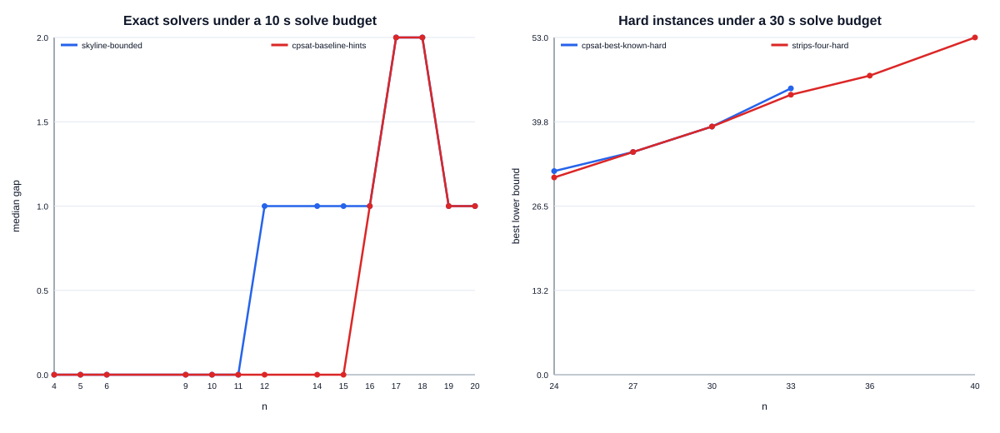

# 정보학 논문용 비교·제거 실험 결과

실행일: 2026-09-27. 사전 프로토콜은 [paper_experiments.md](paper_experiments.md),
최종 원자료와 자동 집계는
`results/paper-benchmarks/benchmark-20260927T122244097906Z-d7e35f7c/`에 있다.
159개 trial의 모든 반환 분할은 실행기와 집계기가 각각 독립적으로 검사했다.

## 환경과 해석 범위

- Windows 11, 공식 CPython 3.12.10, OR-Tools 9.15.6755
- CP-SAT와 띠 모형은 worker 1개, seed 0
- 각 조건 3회 반복
- 일반 정확 비교 10초, 어려운 구성 비교 30초의 solve-call 예산
- 실행시간은 완료 반복의 중앙값

CP-SAT, skyline, 띠 모형의 노드 정의는 서로 다르므로 solver 간 노드 수를 직접
비교하지 않는다. 시간 제한 결과는 불가능성의 증거가 아니다. 띠 모형의 최적값은
일반 문제의 상한도 아니다.

## RQ1. 일반 정확 풀이: skyline과 CP-SAT

비교한 14개 크기 중 CP-SAT는 9개 크기에서 세 반복 모두 정확값을 인증했고,
`n=16`에서는 3회 중 1회 인증했다. skyline은 6개 크기에서 세 번 모두 인증했다.
CP-SAT가 추가로 안정적으로 해결한 크기는 12, 14, 15였다.

- `n=12`: CP-SAT 3/3회 인증, 중앙 전체시간 4.087초. skyline 0/3회,
  중앙 간격 1.
- `n=14`: CP-SAT 3/3회 인증, 6.712초. skyline 0/3회, 간격 1.
- `n=15`: CP-SAT 3/3회 인증, 7.888초. skyline 0/3회, 간격 1.
- `n=17,18`: 두 방법 모두 제한 시간 뒤 간격 2를 남겼다.
- `n=19,20`: 두 방법 모두 간격 1을 남겼다.

작은 크기 4–6에서는 skyline이 훨씬 짧은 전체시간을 보였다. CP-SAT는 매
프로세스의 Python 및 OR-Tools import 비용이 포함되기 때문이다. 반면 크기가 커지면
CP-SAT의 제약 전파가 기준 DFS보다 더 많은 정확 사례를 인증했다.

`n=16`의 CP-SAT가 1/3회만 인증한 사실은 제한 시간 경계의 변동성을 보여준다.
따라서 해결률이 다른 조건 사이에 단일 실행시간으로 속도 배율을 제시하지 않는다.

## RQ2. skyline의 상한 기반 탐색 제어

`prune=true`는 상태별 면적 상한 가지치기와 전역 상한 도달 조기 종료를 함께
사용한다. 따라서 다음 수치는 두 장치의 결합 효과다.

- `n=4`: 중앙 방문 상태가 161,863에서 33으로 약 4,905배 감소했고,
  전체시간은 0.441초에서 0.132초로 약 3.3배 감소했다.
- `n=5`: 중앙 방문 상태가 4,672,638에서 113으로 약 41,351배 감소했고,
  전체시간은 10.176초에서 0.171초로 약 59.5배 감소했다.
- `n=6`: bounded 모드는 3/3회 정확값을 인증했지만 unbounded 모드는 0/3회였고,
  10초 뒤에도 간격 1을 남겼다.

작은 상태 수에서 시간 배율이 노드 배율보다 작은 이유는 프로세스 시작 및 Python
초기화 비용이 고정적으로 포함되기 때문이다.

## RQ3. 초기 구성과 CP-SAT 힌트

순수 11/8 구성의 효과는 크기별로 달랐다.

- `n=16`: 11/8 구성 자체가 상한 21에 도달해 세 번 모두 약 0.14초에 탐색 없이
  인증했다. baseline seed는 약 10초의 CP-SAT 실행이 필요했다.
- `n=17`: 11/8 구성의 padding이 상한 23에 도달해 즉시 인증했다. baseline은
  10초 뒤에도 `21–23`이었다.
- `n=18`: 하한을 22에서 23으로 높여 간격을 2에서 1로 줄였다.
- `n=19`: 반대로 11/8 구성은 23개, baseline은 25개여서 간격이 1에서 3으로
  악화됐다.

따라서 11/8 구성은 점근적으로 강하지만 모든 작은 `n`의 seed로 우월하지 않다.
실제 풀이기에서는 합동류와 사용 가능한 구성 중 가장 강한 것을 선택해야 한다.

같은 11/8 seed에서 힌트 사용 여부는 모든 크기에서 동일한 최종 bounds를 만들었다.
실행시간도 `n=18`에서 11.462초 대 11.398초, `n=19`에서 11.478초 대
11.701초로 방향이 일관되지 않았다. baseline `n=16`에서도 힌트 사용이 1/3회,
미사용이 3/3회 인증했다. 이번 최소 반복 실험은 CP-SAT 힌트의 일관된 이득을
지지하지 않는다. 이는 힌트가 해롭다는 증명도 아니며, 더 많은 seed와 반복을 둔
후속 실험이 필요하다.

## RQ4. 어려운 사례의 하한 생성

30초 조건의 최종 결과는 다음과 같다.

- `n=24`: CP-SAT 최선 하한 32, 띠 모형 31, 독립 상한 33.
- `n=27`: 두 방법 모두 하한 35, 상한 37.
- `n=30`: 두 방법 모두 하한 39, 상한 41.
- `n=33`: best-known 명시적 구성이 상한 45에 도달해 CP-SAT 모델 없이 약
  0.14초에 인증했다. 띠 모형은 하한 44였다.
- `n=36,40`: 자원 안전상 일반 CP-SAT는 실행하지 않았다. 띠 모형은 각각
  하한 47과 53, 상한 49와 55를 반환했다.

이 표준화 benchmark의 하한은 저장소 전체에서 알려진 최선 하한과 다를 수 있다.
예를 들어 기존 연구 실행은 다른 띠 설정과 더 긴 탐색으로 `k(24)=33` 증거를 이미
보유한다. 본 실험의 목적은 기록 갱신이 아니라 동일 조건의 방법 비교다.

일반 CP-SAT의 중앙 모델 생성시간은 `n=24`에서 3.517초, `n=27`에서 6.290초,
`n=30`에서 10.998초로 증가했다. 셀-직사각형 incidence가 O(n^6)으로 증가한다는
분석과 일치하며, `n=36,40`을 공유 데스크톱에서 제외한 판단을 뒷받침한다.

## 실험 중 발견해 수정한 문제

첫 본 실행에서 초기 구성의 하한이 독립 상한과 같아도 CP-SAT가 전체 모형을 만들고
solver를 호출하는 비효율을 발견했다. `n=33`은 탐색이 필요 없는데도 중앙 약 53초가
걸렸다. 이를 OR-Tools import 전에 bounds를 검사하도록 수정했고, 수정 후에는 약
0.14초에 인증한다. 수정 전 159개 trial은 원인과 함께 `STATUS.md`를 붙여 진단
자료로 보존했으며, 위 결론에는 수정 후 실행만 사용했다.

## 논문에서 지지되는 주장

이번 실험으로 다음 주장을 뒷받침할 수 있다.

1. 독립 구성과 상한을 먼저 결합하면 일부 사례에서 최적화 모델 생성을 완전히
   제거할 수 있다.
2. 기준 skyline의 상한 기반 탐색 제어는 작은 사례에서도 방문 상태를 수천–수만 배
   줄이며, 더 큰 사례의 제한 시간 내 인증 여부를 바꾼다.
3. 일반 CP-SAT는 기준 skyline보다 모델 생성비용이 크지만 10초 구간에서 더 많은
   중간 크기의 정확 사례를 인증한다.
4. 제한된 띠 최적화는 일반 최적성 인증기는 아니지만 큰 크기에서 빠르게 검증 가능한
   하한을 제공한다.
5. 점근적으로 강한 구성과 작은 크기에서 좋은 초기해는 같은 개념이 아니며,
   instance별 seed 선택이 필요하다.

반면 “CP-SAT 힌트가 항상 탐색을 개선한다”는 주장은 현재 데이터가 지지하지 않는다.
또한 세 번의 반복은 실행시간 잡음을 줄이는 최소 반복이므로 일반적인 통계적 결론으로
확대하지 않는다.
