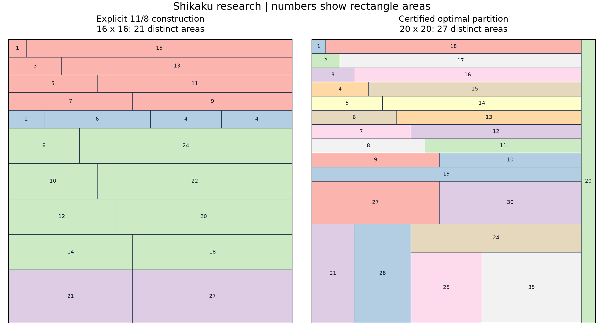
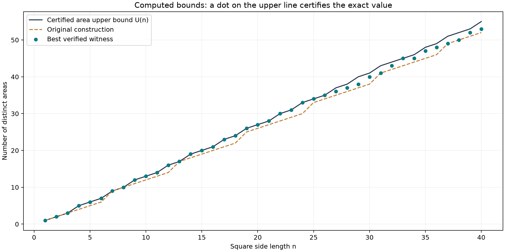

# 연구 진행 보고서 — 2026-09-20

원래 저장소의 연구 노트와 기준 구현에서 출발해, 일반 하한의 개선,
독립 풀이기 구현, 작은 크기의 정확값 계산, 상한의 한계 분석을 진행했다.
출발 커밋은 `1f32d605a81ed491f1f4d8aabfe9adebb6002ce4`이다.
이 보고서에서 ‘새 결과’는 저장소의 이전 상태와 비교한 말이다.
문헌 전체에서 최초라는 주장은 하지 않는다.

## 1. 가장 중요한 결과: 일반 하한의 계수 개선

모든 양의 정수 t에 대해 다음 명시적 분할을 얻었다.

\[
\boxed{k(16t)\ge22t-1.}
\]

이를 작은 정사각형의 포함으로 모든 n에 확장하면,

\[
k(n)\ge22\lfloor n/16\rfloor-1\quad(n\ge16),
\]

따라서 기존의 점근 범위는

\[
\boxed{1.375=\frac{11}{8}
\le\liminf_{n\to\infty}\frac{k(n)}n
\le\limsup_{n\to\infty}\frac{k(n)}n
\le\sqrt2\approx1.414214}
\]

로 좁혀진다. 종전 하한 계수 4/3보다 1/24만큼 크다.
극한의 존재와 정확한 값은 아직 해결하지 않았다.

핵심은 홀수 넓이와 짝수 넓이를 서로 다른 높이의 띠에 배분하는 것이다.
작은 짝수는 한 행에 네 조각씩 압축하고, 높이 2인 띠에서 작은 짝수와
큰 짝수를 동시에 얻는다. 남긴 행에는 높이 3인 띠로 큰 홀수 넓이를 넣는다.
모든 절단은 기요틴 방식으로도 만들 수 있다.

| 구성 | 사용 행 수 | 새로운 넓이 수 |
|---|---:|---:|
| 높이 1, 홀수 넓이 | 4t | 8t |
| 높이 1, 작은 짝수 네 조각 | t | 4t−1 |
| 높이 2, 작은 짝수와 큰 짝수 | 8t | 8t |
| 높이 3, 큰 홀수 | 3t | 2t |
| 합계 | 16t | 22t−1 |

전체 증명, 좌표 구성, 모든 n으로의 패딩은
[이론 진행 문서](theory_progress.md)에 있다.
기존 구성도 남는 두 행을 한 조각으로 묶어 n≡0,5 (mod 6)에서 하한을 1 올렸다.
새 점근 하한은 상수항 때문에 작은 n에서 항상 더 좋지는 않으므로,
실제 함수 `best_partition`은 여러 명시적 구성의 최댓값을 선택한다.



## 2. 정확값: n=1,…,26과 n=33

이번에 합친 증거에서는 **1부터 26까지 모든 n, 그리고 n=33**에서
검증된 분할의 점수가 독립적인 상한 U(n)에 도달한다.
각 분할의 좌표, 넓이 목록과 출처를 저장했다.

| n | k(n) | n | k(n) |
|---:|---:|---:|---:|
| 1 | 1 | 14 | 19 |
| 2 | 2 | 15 | 20 |
| 3 | 3 | 16 | 21 |
| 4 | 5 | 17 | 23 |
| 5 | 6 | 18 | 24 |
| 6 | 7 | 19 | 26 |
| 7 | 9 | 20 | 27 |
| 8 | 10 | 21 | 28 |
| 9 | 12 | 22 | 30 |
| 10 | 13 | 23 | 31 |
| 11 | 14 | 24 | 33 |
| 12 | 16 | 25 | 34 |
| 13 | 17 | 26 | 35 |

이 밖에 **k(33)=45**이다. k(16), k(17), k(33)은 위의 11/8 구성과
단순 패딩으로 직접 증명된다. k(26)는 24×24에서 얻은 33종류의 분할에
넓이 48과 52인 테두리를 붙여 35종류를 만드는 방식으로 확정했다.

20×20의 기존 외부 구성도 실제 좌표로 복원해 검증했다. 동시에 띠 최적화로
다른 27종류 분할을 찾았다. 외부 구성의 출처는
[S. Carnahan의 MathOverflow 답변](https://mathoverflow.net/questions/38151/how-many-different-rectangles-in-terms-of-area-can-fit-in-a-20-unit-wide-squar)이다.

모든 정확값의 최종 인증은 **실제 분할의 독립 검사 + U(n)과의 일치**다.
계산기가 `OPTIMAL`이라고 출력했다는 사실만을 근거로 표를 채우지 않았다.

## 3. 상한에 관해서도 알게 된 점

n보다 크고 2n 이하인 정수 중 직사각형 넓이로 불가능한 값은 소수뿐이다.
합성수 m=ab, 2≤a≤b이면 b≤m/2≤n이기 때문이다.
또한 U(n)의 누적합은 2n 이하에서 이미 면적 예산 n²을 초과한다.

이에 따라 U(n)을 n²개 곱의 생성 없이 소수 체로 정확히 계산했다.
시간은 O(n log log n), 메모리는 O(n)이다.

더 중요한 이론적 결론은

\[
\boxed{\lim_{n\to\infty}U(n)/n=\sqrt2}
\]

라는 점이다. 필요한 소수의 밀도 추정도 이항계수로 직접 증명했다.
따라서 현재의 ‘가능한 넓이 합’ 상한을 정밀하게 계산하는 것만으로는
상한의 선형계수를 √2보다 낮출 수 없다. 더 강한 상한에는 동시 배치에
관한 기하적 제약이 필요하다. [전체 증명](area_upper.md).

## 4. 구현한 것

- **CP-SAT 정확 풀이기:** 모든 직사각형 선택 변수, 각 칸의 정확한 한 번 덮임,
  넓이 등장 변수로 원래 문제를 직접 푼다. [모형과 상태 처리](cpsat.md).
- **띠 최적화:** 띠 높이와 폭의 정수 분할을 선택한다. 제한된 모형의 최적값을
  원래 문제의 상한으로 오인하지 않도록 상태를 구분한다. [설명](strips.md).
- **명시적 구성:** 11/8 하한, 남는 두 행 개선, 기존 20×20 구성과 패딩.
- **테두리 확장:** 이미 찾은 분할을 더 큰 정사각형에 넣고 두 테두리의 절단을
  비교해 새로운 넓이를 추가한다. 값 k(m)만이 아니라 넓이 집합을 사용한다.
- **실험과 집계:** 설정, 의존성 버전, 소스 스냅샷, 시간과 좌표를 저장한다.
  집계 시 모든 증거를 다시 검사한다.

기존 skyline의 탐색 순서, 초기 구성과 기본 설정은 그대로 보존했다.
새 풀이기는 공통 CLI에서 설정 파일로 선택한다. 기준 탐색과 명시적 구성은
표준 라이브러리만 필요하고, 두 최적화 풀이기는 OR-Tools를 선택적으로 사용한다.

## 5. 검증과 계산 조건

- OR-Tools 9.15.6755, Python 3.13.15에서 전체 **33개 테스트 통과**.
- OR-Tools가 없는 기본 환경에서도 26개 통과, 선택 풀이기 테스트 7개는 건너뜀.
- n=1,…,4의 일반 문제는 독립 칸 완전열거와 교차검증.
- n=1,…,6의 띠 문제는 독립적인 폭 구성 완전열거와 교차검증.
- 11/8 구성과 패딩은 16≤n≤256의 모든 241개 분할에서 칸별 검사.
- 소수 체 상한은 n=1,…,200에서 모든 곱을 직접 생성한 상한과 비교.
- 저장된 최종 40개 분할 모두 겹침, 빈칸, 경계와 넓이 개수를 재검사.
- 시간 초과, 실행 가능 해와 최적해의 구분, 선택 의존성 부재도 검사.

일반 CP-SAT의 주 실험은 worker 1개·크기당 solver 시간 10초,
띠 실험은 worker 4개·크기당 8∼60초다. 기준 skyline은 2초 제한이다.
시간 제한의 범위와 모델 생성 시간이 다르므로 이를 공정한 속도 비교나
가속 배율로 해석하지 않는다. 다중 worker 실행은 같은 seed에서도 달라질 수 있다.
좌표 증거의 검증과 그에 따른 정확값 인증은 탐색의 재현 여부와 독립적이다.

## 6. 아직 남은 문제와 다음 실험

40 이하에서 처음 미확정인 값은 **36≤k(27)≤37**이다. 이어서
37≤k(28)≤38, 38≤k(29)≤40, 40≤k(30)≤41이 남았다.
전체 [1∼40 결과표](../results/research-20260920/table.md)와
[좌표·출처·실험 비교 JSON](../results/research-20260920/summary.json)을 함께 보관했다.



후속 작업은 다음 순서가 유용하다.

1. **27×27에서 37종류의 존재 여부.** 상한 달성 여부만 묻는 판정 모형과
   현재 36종류의 증거를 이용한다. 띠의 조각 수 제한과 일반 분할을 분리해 비교한다.
2. **11/8 구성의 일반화.** 홀짝 구분을 2·3의 배수 여부까지 세분화하고,
   높이 1·2·3·6 사이에서 작은 넓이를 배분한다. 새 계수는 별도 구성 증명이 필요하다.
3. **기하적 상한.** 큰 소수 넓이에 필요한 폭 1 조각, 경계 사용량, 남은 공간의
   형태를 이용해 U(n)보다 강한 제약을 만든다.
4. **기요틴과 일반 분할의 차이.** 이번 하한 구성은 기요틴 방식이다.
   일부 계산 사례에서 상한을 달성했다는 사실만으로 항상 충분하다고 결론내릴 수 없다.

이번에 정확값을 확정한 모든 n에서 k(n)=U(n)이지만, 일반적인 등식은 아직 추측 후보다.
시간 안에 상한을 달성하지 못한 사례도 이 등식의 반례가 아니다.

## 7. 실행

```sh
python -m pip install -r requirements-cpsat.txt
python -m unittest discover -s tests -v
python -m experiments.theory_strip
python -m shikaku 14 --config experiments/configs/cpsat.json --time-limit 10
python -m shikaku 24 --config experiments/configs/strips6.json --time-limit 60
```

이번 실행의 원자료는 다음과 같다. 각 폴더에 당시 코드와 설정이 함께 있다.

- [CP-SAT 1∼20](../results/20260920T104210002937Z-e7b1665f/report.json)
- [기준 탐색 1∼20](../results/20260920T104403579529Z-1f562ebc/report.json)
- [4조각 띠 19∼25](../results/20260920T104332109971Z-1547e2a8/report.json)
- [6조각 띠 24·30](../results/20260920T104446100500Z-4b49b573/report.json)
- [4조각 띠 26∼40](../results/20260920T104530634378Z-951b1111/report.json)
- [일반 CP-SAT 24, 미확정](../results/20260920T104601257990Z-4546e47d/report.json)

최종 집계는 `python -m experiments.summarize --runs <위 실행 폴더들>`로 만든다.
이미 있는 출력 폴더를 덮어쓰지 않으므로 재실행 시 `--output`으로 새 폴더를
지정한다. 그림은 선택적으로 matplotlib를 설치한 환경에서
`python -m experiments.render_research <summary.json>`으로 생성할 수 있다.
