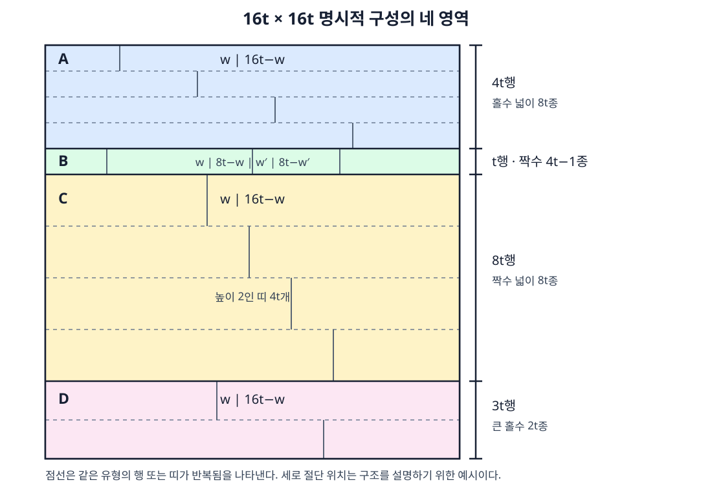

# 격자 직사각형 분할에서 서로 다른 넓이의 최대화

## 초록

\(n\times n\) 격자를 직사각형으로 분할할 때 나타나는 서로 다른 넓이의 최대 개수 \(k(n)\)을 연구한다. 모든 양의 정수 \(t\)에 대해 \(k(16t)\ge22t-1\)인 명시적 구성을 제시하여 점근 하한 \(11/8\)을 얻고, 가능한 넓이에 기반한 상한 \(U(n)\)이 \(U(n)/n\to\sqrt2\)를 만족함을 보인다. Skyline 완전탐색과 일반 CP-SAT 모형 및 독립 좌표 검증기를 결합하여 \(1\le n\le26\)과 \(n=33\)의 정확값을 인증하였다. 비교 실험에서는 상한 기반 가지치기와 명시적 초기 구성이 정확 탐색의 규모를 크게 줄이는 것을 확인하였다.

**주제어:** 직사각형 분할, 조합최적화, CP-SAT, 완전탐색, 인증 계산

## 1. 서론

Shikaku는 격자를 직사각형으로 분할하되, 각 직사각형이 정확히 하나의 숫자를 포함하고 그 숫자가 직사각형의 넓이를 나타내도록 하는 퍼즐이다. 본 연구는 이와 같은 분할 구조에서 출발하여, 숫자 단서가 없을 때 하나의 정사각형 안에 얼마나 많은 서로 다른 넓이를 동시에 배치할 수 있는지를 다룬다. \(k(n)\)을 \(n\times n\) 격자의 직사각형 분할에서 나타날 수 있는 서로 다른 넓이의 최대 개수라 한다. 직사각형의 꼭짓점은 격자점에 놓이며 같은 넓이의 반복은 허용한다.

개별 직사각형의 가능한 넓이는 정수의 곱으로 쉽게 열거할 수 있지만, 선택한 넓이들을 겹침이나 빈칸 없이 동시에 배치할 수 있는지는 별개의 문제이다. 따라서 가능한 넓이와 면적 합만으로는 \(k(n)\)을 결정하기 어렵다. 본 연구에서는 여러 크기에 확장되는 명시적 구성과 넓이 기반 상한을 제시하고, 완전탐색과 제약 최적화를 결합한다. 계산 결과는 실제 분할 좌표의 독립 검증과 유효한 상한의 일치를 통해서만 정확값으로 인정한다.

## 2. 수학적 상한과 하한

### 2.1. 가능한 넓이에 기반한 상한

서로 다른 넓이가 \(k\)개라면 각 넓이를 갖는 직사각형을 하나씩 선택한 넓이의 합은 \(n^2\) 이하이다. 서로 다른 양의 정수 \(k\)개의 최소 합을 이용하면

\[
k(n)\le T(n):=
\left\lfloor\frac{\sqrt{8n^2+1}-1}{2}\right\rfloor
\]

을 얻는다. 실제로 가능한 넓이의 집합을

\[
A_n=\{ab:1\le a,b\le n\}=\{a_1<a_2<\cdots<a_M\}
\]

이라 하고

\[
U(n):=\max\left\{m:\sum_{i=1}^{m}a_i\le n^2\right\}
\]

이라 두면 \(k(n)\le U(n)\le T(n)\)이다. 예를 들어 \(n=16\)에서는 소수 넓이 17과 19가 불가능하여 \(T(16)=22\)이지만 \(U(16)=21\)이다.

\(1,\ldots,n\)은 모두 가능한 넓이이다. 또한 \(n<m\le2n\)인 합성수는 \(m=ab\), \(2\le a\le b\le n\)으로 표현되므로 이 구간에서 불가능한 넓이는 소수뿐이다. \(2n\) 이하의 가능한 넓이만으로 면적 예산을 초과하므로, 에라토스테네스의 체를 사용하면 \(U(n)\)을 \(O(n\log\log n)\) 시간과 \(O(n)\) 메모리로 계산할 수 있다. \(\pi(x)\)를 \(x\) 이하의 소수 개수라 하면

\[
T(n)-\bigl(\pi(T(n))-\pi(n)\bigr)
\le U(n)\le T(n).
\]

\(\pi(x)=o(x)\)이고 \(T(n)/n\to\sqrt2\)이므로 \(U(n)/n\to\sqrt2\)이다. 따라서 이 상한의 점근 계수를 낮추려면 직사각형들의 동시 배치에 관한 기하적 제약이 필요하다.

### 2.2. \(11/8\) 명시적 구성

**정리 1.** 모든 양의 정수 \(t\)에 대해

\[
k(16t)\ge22t-1
\]

이다.

**증명.** \(16t\times16t\) 정사각형을 그림 1의 네 영역으로 나누고, 높이가 일정한 수평 띠를 세로로 절단한다.

**그림 1. \(16t\times16t\) 명시적 구성. 절단 위치는 반복 구조를 설명하기 위한 예시이다.**

| 영역 | 구성 | 사용 행 수 | 새 넓이 수 |
|---|---|---:|---:|
| A | 높이 1, \(w\mid16t-w\), \(w=1,3,\ldots,8t-1\) | \(4t\) | \(8t\) |
| B | 높이 1, 두 폭 쌍 \((w,8t-w)\)을 한 행에 배치 | \(t\) | \(4t-1\) |
| C | 높이 2, \(w\mid16t-w\), \(w=4t,\ldots,8t-1\) | \(8t\) | \(8t\) |
| D | 높이 3, \(w\mid16t-w\), \(w=6t+1,6t+3,\ldots,8t-1\) | \(3t\) | \(2t\) |

**표 1. 네 영역의 구성과 생성되는 서로 다른 넓이의 수.**

A는 \(16t\)보다 작은 홀수 \(8t\)개를 만든다. B에서는 짝수 \(w=2,4,\ldots,4t\)마다 폭 합이 \(8t\)인 쌍 \((w,8t-w)\)을 만들고, \(2t\)개의 쌍을 두 개씩 한 행에 배치한다. 이때 \(8t\)보다 작은 짝수 \(4t-1\)개가 나타난다. C의 넓이 \(2w\)와 \(32t-2w\)는 \(16t\)를 기준으로 분리되어 \(8t\) 이상의 짝수 \(8t\)개를 만든다. D의 넓이 \(3w\)와 \(3(16t-w)\)는 \(24t\)를 기준으로 분리되어 \(16t\)보다 큰 홀수 \(2t\)개를 만든다. 홀짝과 범위가 분리되므로 네 영역의 넓이는 서로 겹치지 않는다. 전체 행 수와 넓이 수는 각각

\[
4t+t+8t+3t=16t,\qquad
8t+(4t-1)+8t+2t=22t-1
\]

이며 각 띠의 폭 합은 \(16t\)이다. 따라서 유효한 분할이다. \(\square\)

일반적인 \(n\ge16\)에 대해서는 \(m=16\lfloor n/16\rfloor\) 크기의 구성을 왼쪽 위에 놓고, 남은 오른쪽 \(m\times(n-m)\) 영역과 아래쪽 \((n-m)\times n\) 영역을 두 직사각형으로 채운다. 기존 넓이가 보존되므로

\[
k(n)\ge22\left\lfloor\frac n{16}\right\rfloor-1
\ge\frac{11}{8}n-\frac{173}{8}.
\]

2.1절의 상한과 결합하면

\[
\boxed{
\frac{11}{8}
\le\liminf_{n\to\infty}\frac{k(n)}n
\le\limsup_{n\to\infty}\frac{k(n)}n
\le\sqrt2
}
\]

를 얻는다.

## 3. 검증 가능한 계산 체계와 실험 결과

### 3.1. 인증 절차와 정확 풀이기

명시적 구성의 좌표를 검사하여 얻은 초기 하한을 \(B\), 2.1절의 상한을 \(U(n)\)이라 하면 \(B\le k(n)\le U(n)\)이다. 두 값이 같으면 탐색 없이 정확값을 인증한다. 그렇지 않으면 Skyline 또는 CP-SAT으로 하한을 개선하거나 계산 상한을 얻는다. 반환된 모든 분할은 별도의 검증기가 각 칸의 경계, 겹침, 빈칸 및 서로 다른 넓이 수를 다시 검사한다. 시간 제한에 도달하고 하한과 상한이 다르면 정확값이 아니라 인증된 범위만 보고한다.

Skyline은 현재 분할 경계를 열별 높이 배열로 표현하고 첫 빈칸을 덮는 모든 직사각형으로 분기한다. 이 규칙은 모든 분할을 빠짐없이 생성한다. 아직 사용하지 않은 가능한 넓이와 남은 면적으로 추가 가능한 넓이 수를 계산하여 현재 최선값을 넘을 수 없는 상태는 제거한다.

CP-SAT은 모든 후보 직사각형 \(R\)에 이진 변수 \(x_R\)를 두고, 각 격자 칸 \(c\)에 대해

\[
\sum_{R\ni c}x_R=1
\]

을 부여한다. 넓이 \(a\)의 등장 여부를 \(y_a\)로 나타내고 \(\sum_a y_a\)를 최대화한다. 후보 변수는 \(O(n^4)\)개이지만 셀-직사각형 포함 관계 항은 \(O(n^6)\)개이므로 큰 \(n\)에서는 모형 생성도 병목이 된다. 일부 큰 사례의 좌표는 수평 띠로 제한한 보조 탐색에서 얻었지만, 제한 모형의 최적성은 원래 문제의 최적성 근거로 사용하지 않았다.

### 3.2. 정확값과 비교 실험

검증된 좌표의 하한과 \(U(n)\)이 일치하여 \(1\le n\le26\)의 모든 값과 \(k(33)=45\)를 확정하였다. 대표적으로

\[
k(16)=21,\quad k(20)=27,\quad
k(24)=33,\quad k(26)=35
\]

이다. 40 이하에서 처음으로 결정되지 않은 값은 \(36\le k(27)\le37\)이다.

비교 실험은 Windows 11, CPython 3.12.10, OR-Tools 9.15.6755에서 수행하였다. CP-SAT은 작업자 수 1과 난수 시드 0을 사용하였다. 각 조건을 세 번 반복하고 일반 정확 비교의 풀이기 호출을 10초로 제한하였다. 서로 다른 풀이기의 노드 정의는 직접 비교하지 않았다.

| 실험 항목 | 핵심 결과 | 해석 |
|---|---|---|
| 일반 정확 풀이 | 14개 크기 중 CP-SAT은 9개, Skyline은 6개에서 3회 모두 인증 | 중간 크기에서는 CP-SAT이 더 많은 사례를 해결함 |
| Skyline 상한 제어, \(n=5\) | 방문 상태 4,672,638개에서 113개, 전체시간 10.176초에서 0.171초 | 상한이 탐색 공간을 크게 줄임 |
| Skyline 상한 제어, \(n=6\) | 사용 시 3회 모두 인증, 제거 시 모두 시간 제한 | 가지치기가 인증 가능성을 바꿈 |
| \(11/8\) 구성, \(n=16,17\) | 각각 상한 21과 23에 도달하여 약 0.14초에 탐색 없이 인증 | 명시적 구성이 최적화 모형을 제거함 |
| CP-SAT 모델 생성 | \(n=24,27,30\)에서 중앙 3.517초, 6.290초, 10.998초 | \(O(n^6)\) 포함 관계가 확장성을 제한함 |

**표 2. 두 정확 풀이기와 핵심 구성요소의 비교 결과.**

CP-SAT은 \(n=12,14,15\)에서 세 번 모두 인증했지만 Skyline은 간격 1을 남겼다. 반면 작은 크기에서는 고정비용이 작은 Skyline이 더 빨랐다. \(11/8\) 구성은 \(n=18\)의 초기 하한을 22에서 23으로 높였지만 \(n=19\)에서는 기존 소규모 구성보다 약했다. 따라서 점근적으로 강한 구성과 작은 사례에서 좋은 초기해는 같지 않다. CP-SAT 힌트 사용 여부는 일관된 차이를 보이지 않았으며, 명시적 구성의 주된 효과는 힌트보다 하한 개선과 조기 인증에서 나타났다.

## 4. 결론

본 연구에서는 \(k(16t)\ge22t-1\)인 명시적 분할로 점근 하한 \(11/8\)을 얻고, 넓이 기반 상한 \(U(n)\)의 점근 계수가 \(\sqrt2\)임을 보였다. 또한 두 정확 풀이기와 독립 좌표 검증을 결합하여 \(1\le n\le26\)과 \(n=33\)의 정확값을 인증하였다. 상한 기반 가지치기는 완전탐색의 규모를 크게 줄였고, 명시적 구성과 상한이 일치한 사례에서는 최적화 탐색 자체를 생략할 수 있었다.

넓이 기반 상한은 동시 배치의 기하적 제약을 반영하지 않으며, 일반 CP-SAT 모형은 \(O(n^6)\)개의 포함 관계 항 때문에 큰 사례에서 확장성이 제한된다. 후속 연구에서는 \(27\times27\) 격자에서 넓이 37종류를 갖는 분할의 존재 여부를 판정하고, 배치 구조를 반영한 가지치기와 기하적 상한을 개발할 필요가 있다.
