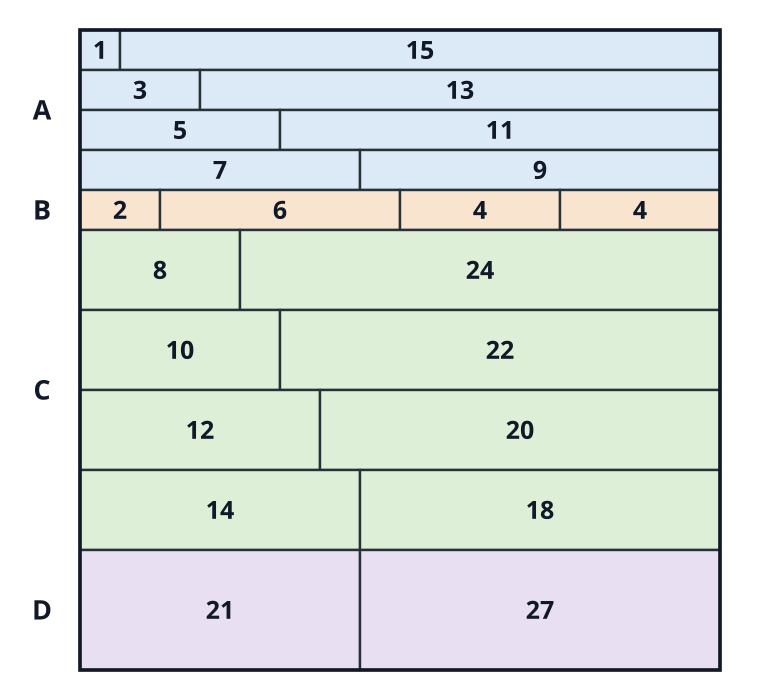

# 격자 직사각형 분할에서 서로 다른 넓이 수의 상·하한과 계산적 최적화

## 초록

\(n\times n\) 격자를 정수 변 길이의 직사각형으로 분할할 때 서로 다른 넓이의 최대 개수를 \(k(n)\)이라 한다. 개별 직사각형으로 실현할 수 있는 넓이에서 상한 \(U(n)\)을 도출하여 \(U(n)/n\to\sqrt2\)임을 보이고, \(k(16t)\ge22t-1\)인 구성으로 점근 하한 \(11/8\)을 얻는다. 유한한 격자에는 Skyline 완전탐색과 CP-SAT 모형을 적용하고, 검증된 분할의 하한이 유효한 상한과 일치할 때 정확값으로 판정하였다. 그 결과 \(1\le n\le26\)과 \(n=33\)의 정확값을 결정했으며, 가장 작은 미결정 사례는 \(36\le k(27)\le37\)이다.

**주제어:** 직사각형 분할, 구성적 하한, 완전탐색, 제약 최적화, CP-SAT

## ABSTRACT

Motivated by the rectangle-partition structure underlying Shikaku, we study the maximum number \(k(n)\) of distinct rectangle areas in a partition of an \(n\times n\) grid into rectangles with integer side lengths. We derive an upper bound \(U(n)\) from individually realizable areas and prove that \(U(n)/n\to\sqrt2\). An explicit construction gives \(k(16t)\ge22t-1\), yielding an asymptotic lower bound of \(11/8\). For finite grids, we apply a Skyline exhaustive search and a CP-SAT model. A value is reported as exact only when a separately validated partition meets a valid upper bound. This determines \(k(n)\) for \(1\le n\le26\) and \(n=33\); the smallest unresolved case is \(36\le k(27)\le37\).

**Keywords:** Rectangle partition, Constructive lower bound, Skyline search, Constraint optimization, CP-SAT

## 1. 서론

Shikaku는 주어진 숫자를 넓이로 갖는 직사각형들로 격자를 분할하는 퍼즐이다. 본 연구는 단서 위치와 해의 유일성을 고정하지 않고, 격자 직사각형 분할에서 서로 다른 넓이의 수를 최대화한다. 직사각형의 꼭짓점은 격자점에 놓이며 같은 넓이의 반복은 허용한다. 개별 넓이의 실현 가능성과 여러 직사각형의 동시 배치는 다른 문제이므로, 수학적 상·하한과 Skyline 및 CP-SAT을 함께 사용한다.

## 2. 수학적 상한과 하한

### 2.1. 상한

서로 다른 넓이가 \(k\)개이면 각 넓이의 직사각형을 하나씩 고른 합은 \(n^2\) 이하이다. 따라서

\[
k(n)\le T(n):=
\left\lfloor\frac{\sqrt{8n^2+1}-1}{2}\right\rfloor.
\]

한 직사각형으로 실현할 수 있는 넓이를 \(A_n=\{ab:1\le a,b\le n\}=\{a_1<\cdots<a_M\}\)이라 하고

\[
U(n):=\max\left\{m:\sum_{i=1}^{m}a_i\le n^2\right\}
\]

이라 두면 \(k(n)\le U(n)\le T(n)\)이다. \(T(n)<2n\)이며 \(n<m\le2n\)에서 실현되지 않는 수는 소수뿐이다. 소수의 개수가 \(o(n)\)이므로 \(U(n)=T(n)-o(n)\)이고 \(U(n)/n\to\sqrt2\)이다. 다만 \(U(n)\)은 여러 직사각형의 동시 배치를 반영하지 않는다.

### 2.2. \(11/8\) 구성적 하한

**정리 1.** 모든 양의 정수 \(t\)에 대해 \(k(16t)\ge22t-1\)이다.

**그림 1. \(t=1\)인 \(16\times16\) 분할. 숫자는 넓이이며, 넓이 4만 반복되어 서로 다른 넓이는 21종류이다.**

| 영역 | 띠의 높이와 폭 | 띠 수 | 새 넓이 수 |
|---|---|---:|---:|
| A | \(1;(w,16t-w),\ w=1,3,\ldots,8t-1\) | \(4t\) | \(8t\) |
| B | \(1;(4j-2,8t-4j+2,4j,8t-4j)\) | \(t\) | \(4t-1\) |
| C | \(2;(w,16t-w),\ w=4t,\ldots,8t-1\) | \(4t\) | \(8t\) |
| D | \(3;(w,16t-w),\ w=6t+1,6t+3,\ldots,8t-1\) | \(t\) | \(2t\) |

**표 1. A–D 영역의 띠 구성. B에서는 \(1\le j\le t\)이다.**

표의 범위에 따라 A와 D에서는 서로 겹치지 않는 홀수가, B와 C에서는 서로 겹치지 않는 짝수가 나타나며 B의 넓이 \(4t\)만 두 번 생긴다. 전체 높이와 서로 다른 넓이 수는

\[
4t+t+2(4t)+3t=16t,
\qquad
8t+(4t-1)+8t+2t=22t-1
\]

이므로 유효한 분할이다. 일반적인 \(n\ge16\)에서는 \(m=16\lfloor n/16\rfloor\) 크기의 구성을 넣고 남은 오른쪽과 아래쪽 영역을 직사각형으로 채워

\[
k(n)\ge22\left\lfloor\frac n{16}\right\rfloor-1
\ge\frac{11}{8}n-\frac{173}{8}
\]

을 얻는다. 따라서

\[
\boxed{
\frac{11}{8}
\le\liminf_{n\to\infty}\frac{k(n)}n
\le\limsup_{n\to\infty}\frac{k(n)}n
\le\sqrt2
}.
\]

## 3. 계산 방법과 결과

검증된 분할이 주는 하한을 \(\ell(n)\)이라 하자. \(\ell(n)=U(n)\)이면 정확값이 결정되며, 두 값이 다르면 다음 두 방법으로 간격을 줄인다.

### 3.1. Skyline 완전탐색

Skyline은 채워진 높이를 열별 배열로 나타내고, 가장 낮은 열 중 왼쪽 첫 위치를 덮는 모든 직사각형으로 분기한다[1]. 완성된 분할의 해당 직사각형이 반드시 한 분기에 포함되므로 모든 분할을 빠짐없이 탐색한다. 남은 면적과 아직 쓰지 않은 넓이로 추가 가능한 종류 수를 제한하고, 현재 최선값을 넘지 못하는 상태를 제거한다.

### 3.2. CP-SAT 모형

후보 직사각형 \(R\)의 선택을 \(x_R\), 넓이 \(a\)의 등장을 \(y_a\)로 나타내고[2]

\[
\sum_{R\ni c}x_R=1,
\qquad
x_R\le y_a\quad(\operatorname{area}(R)=a),
\qquad
y_a\le\sum_{\operatorname{area}(R)=a}x_R
\]

를 부여하여 \(\sum_a y_a\)를 최대화한다. 후보는 \(O(n^4)\)개이고 셀-직사각형 포함 관계는 \(O(n^6)\)개이므로 큰 격자에서는 모형 생성과 최적성 증명이 병목이 된다.

### 3.3. 결과

반환된 분할은 별도 프로그램으로 경계, 완전 덮임 및 넓이 수를 검사하였다. 검증된 하한이 \(U(n)\)과 일치하여 \(1\le n\le26\)의 모든 값과 \(k(33)=45\)를 결정하였다. 대표적으로

\[
k(16)=21,\quad k(20)=27,\quad
k(24)=33,\quad k(26)=35
\]

이며, 가장 작은 미결정 사례는 \(36\le k(27)\le37\)이다.

동일한 10초 제한에서 14개 크기를 세 번씩 비교한 결과, CP-SAT은 9개, Skyline은 6개 크기에서 매번 정확값을 결정하였다. 특히 \(n=12,14,15\)에서는 CP-SAT만 상·하한의 차이를 없앴다. Skyline에서 상태별 상한 가지치기와 전역 상한 도달 시 조기 종료를 함께 제거하면 \(n=5\)의 방문 상태가 113개에서 4,672,638개로 증가하였다. 반면 \(n=16,17\)에서는 구성적 하한이 상한에 도달하여 탐색이 필요하지 않았다.

## 4. 결론

구성적 하한과 개별 넓이 상한으로 \(k(n)/n\)의 점근적 범위를 \(11/8\)과 \(\sqrt2\) 사이로 좁혔으며, 두 계산 방법과 분할 검증으로 \(1\le n\le26\) 및 \(n=33\)의 정확값을 결정하였다. 가장 작은 미결정 사례는 \(36\le k(27)\le37\)이다. 후속 연구에서는 동시 배치를 반영한 상한과 더 큰 격자에 적용할 수 있는 탐색 방법이 필요하다.

## 참고문헌

[1] N. García-Colín, D. Leemans, M. Müßig, and É. Roldán, “There is no perfect Mondrian partition for squares of side lengths less than 1001,” *arXiv:2311.02385*, 2023. https://arxiv.org/abs/2311.02385

[2] L. Perron, F. Didier, and S. Gay, “The CP-SAT-LP Solver,” in *29th International Conference on Principles and Practice of Constraint Programming (CP 2023)*, LIPIcs, vol. 280, pp. 3:1–3:2, 2023. https://doi.org/10.4230/LIPIcs.CP.2023.3
